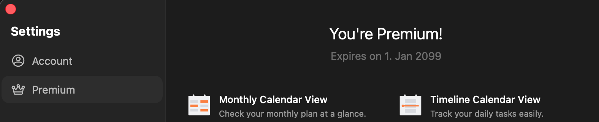
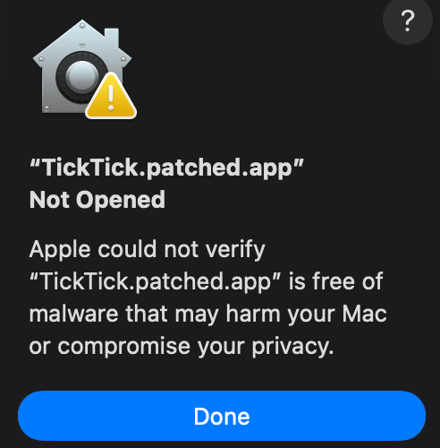

# Unlimited TickTick - macOS

> [!TIP]
> You can also find a Windows version of this patch in the [Unlimited TickTick - Windows](https://github.com/yazdipour/unlimited-ticktick-windows) repository.

A standalone set of tools to statically patch the official TickTick macOS application. It injects a custom Objective-C dynamic library to modify runtime behavior without needing an external debugger or runtime injection tool like Frida.

This creates a fully re-signed `.app` bundle that you can launch natively on macOS by simply double-clicking it.



## Build via GitHub Actions

If you don't have a local macOS development environment set up, or just prefer to build the patched app in the cloud, you can use GitHub Actions to generate your own patched DMG.

1. **Fork** this repository using the fork button on the top right.
2. Go to the **Actions** tab on your newly forked repository. If prompted, click the button to enable workflows.
3. On the left sidebar under "All workflows", click on **Build Patched TickTick**.
4. Click the **Run workflow** button on the right side.
5. You can optionally provide a direct URL to a specific official TickTick DMG. Either provide a URL to your app or dmg, or you can find the latest version at the official TickTick website and copy the download link to the DMG file.
6. Click **Run workflow** and wait for the build to finish.
7. Go to the **Releases** section on the right side of your repository's main page. You will find a new **Draft** release containing your patched `TickTick.patched.dmg` file ready to download.
8. Download the DMG, open it, and drag the patched app to your Applications folder.
9. Initially you may get this error or something similar. To pass this issue you need to run this command in terminal: `xattr -cr ~/Applications/TickTick.app` to clear the quarantine attribute from the app bundle. After that, you should be able to launch TickTick without any issues.


<details>
<summary>Troubleshooting</summary>

### `The application "TickTick.patched.app" can't be opened`

Check the generated bundle signature:

```bash
codesign --verify --deep --strict --verbose=2 "build/TickTick.patched.app"
```

Also confirm the app executable and injected dylib have matching architectures:

```bash
lipo -archs "build/TickTick.patched.app/Contents/MacOS/TickTick"
lipo -archs "build/TickTick.patched.app/Contents/MacOS/libPatchZero.dylib"
```

Both should print the same architecture list.

### `Namespace CODESIGNING, Code 1, Taskgated Invalid Signature`

This usually means macOS rejected the app at launch even though the bundle may look valid on disk. The current script avoids the common cause by signing the final app with only local debug/code-loading entitlements:

- `com.apple.security.cs.disable-library-validation`
- `com.apple.security.cs.allow-dyld-environment-variables`
- `com.apple.security.get-task-allow`

Verify the embedded entitlements with:

```bash
codesign -d --entitlements :- "build/TickTick.patched.app" 2>/dev/null | plutil -p -
```

If restricted production entitlements such as `com.apple.developer.team-identifier`, `com.apple.developer.aps-environment`, associated domains, or application groups appear in the final app signature, rebuild with the current `patch.sh`.

### `MACOSX_DEPLOYMENT_TARGET` warning from `insert_dylib`

This warning is from building the helper tool:

```text
The macOS deployment target 'MACOSX_DEPLOYMENT_TARGET' is set to 10.9...
```

It is not the cause of TickTick launch failures. The helper still builds and is only used to modify the Mach-O load commands.

</details>

## Disclaimer

This repository is provided for informational and educational purposes only.
